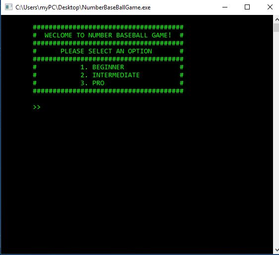

# NumberBaseballGame
It's kind of a guessing game, but it has a twist ! Do you want to try it out ?

# Background
Back in high school, I used to play a number guessing game on a piece of paper with friends. This game I played with freidns was a bit different from how people intuitively know about number guessing games. No one knew where the game was originated from, but it was phenomenal in my childhood.

# Rules
With a little twist of baseball game rules, players get to guess the number of computer which is of 4 digits (repetitive). A total number of 10 guesses is allowed and each time players take a guess, a condition is given in form of [ _ S _ B _ O ].
- S represents the number of strikes / 1 Strike means players guessed a correct dgit at correct location
- B represents the number of balls / 1 Ball means players guessed a correct digit at incorrect location 
- O represents the number of outs 1 Out means players guessed an incorrect digit at incorrect location

*The more Outs you have, the clearer computer's number be

# To help your understanding better , here's an example.
Supposed computer chose a number, 1234, and player takes his/her first guess as 5431. 
1. The condition to be given is [ 1S 2B 1O ]. 
2. Because 134 are in the computer's number and the location of 3 matches with the user's guess. 
 - 1 Out results from 5 not being in the computer's number.

# Demo

