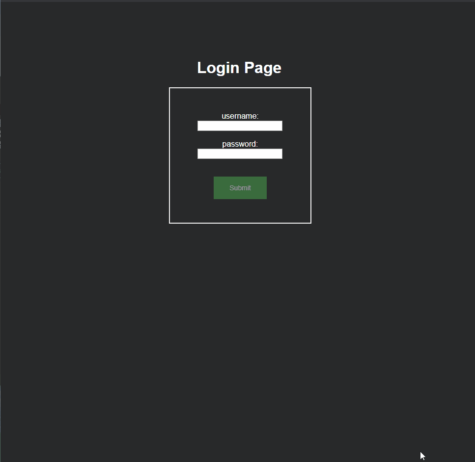
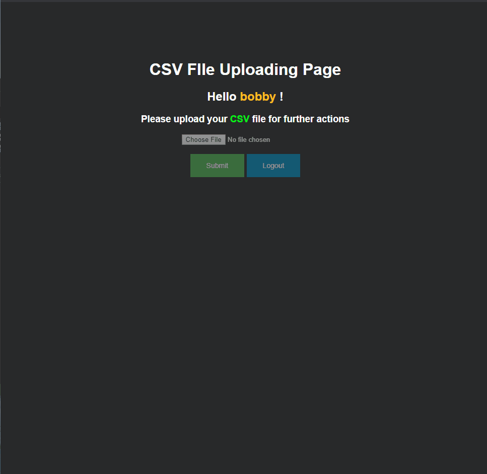
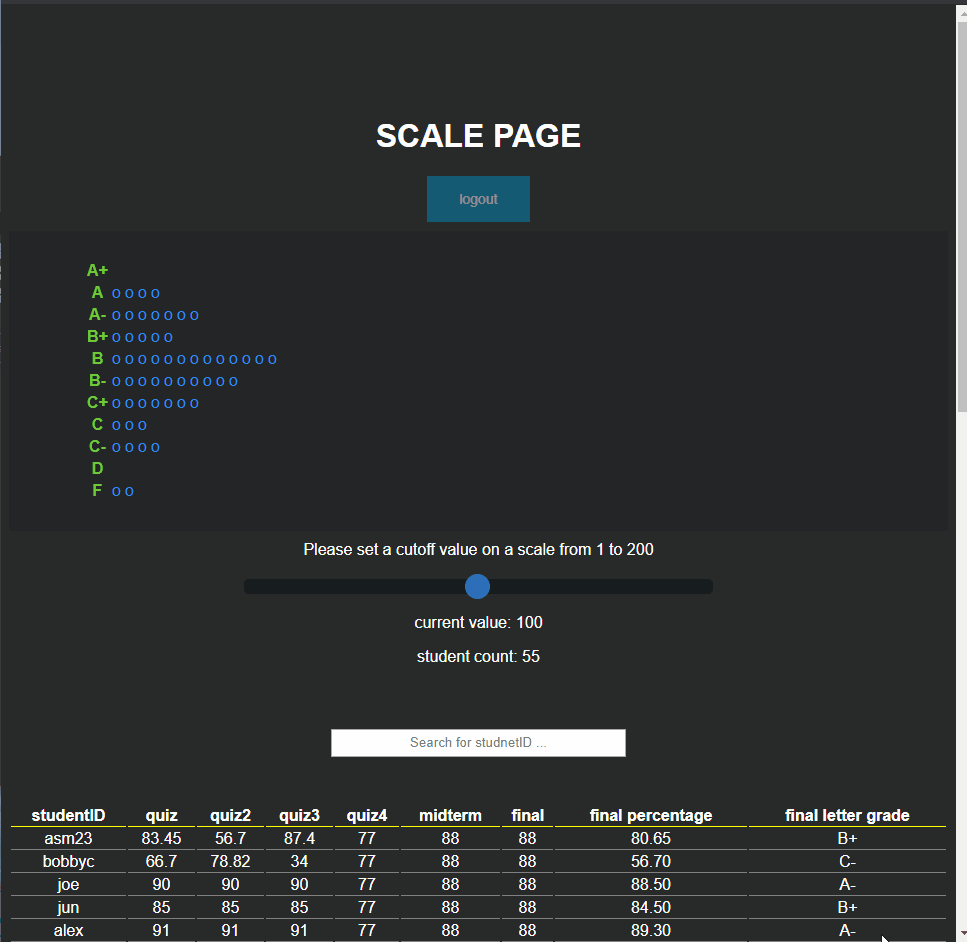

# Description

A login system and CSV file uploading feature with MD5 hashing, express-session and live Histogram

# Dependencies

1. Please install necessary npm packages via "npm i"
2. Inside public/uploads, valid user's csv files will be saved. If the name of a csv file exists, the existing file will be overwritten by a new submission.
3. Docker Repo: https://hub.docker.com/repository/docker/wbot1234567/final-app

# Features

1. Login - user credentials are hashed with MD5
2. Session - user session will contain username, password, and their files
3. CSV file uploading - if a csv file has total less than 100, user will be asked to upload a new csv file
4. Scale bar, histogram and data table - users can update their csv data live
5. Table Search - users can serach studentID
6. In case of errors, error messages will be displayed to users

# Technologies

html5, css3, express.js, ejs, node.js, express-session, csv-parser, md5-hash, docker

# CSV Format

1. CSV file must have entries separated by a comma
2. CSV file must start with headers and have a row beginning with "total"

# Note

1. When applying scaling, students who exceed 100% will be counted towards A+ in spite of their grades over 100%;
2. csv files will be saved in 'public\uplods' and it will not affect subsequent jobs unless the user reuploads the changed file.
3. For uploading csv file, I tested with several csv files created by Windows office, text document and professor, all of them were identified to have application/octet-stream as meme types. I couldn't fix this behaviour because it's beyond my comprehensibility. As a solution to this, I askd the user to upload csv file on the uploading page. (Possible bug is any other file type that contains a string in form of 'total,32,12,42,45.66' and so on).
4. CSV test files can be found in '../public/uplodas'

# Demo

## Login

## CSV file submission

## Grade Scaling and Table Searching

