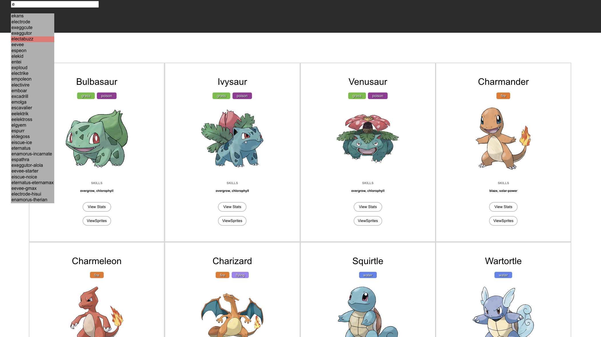

# Mini Pokedex App

- A simple Pokedex app that allows the user to query pokemons by their names.
- [WebSite](https://pokedexmini.netlify.app/)

### Peeview

## To run this program locally

1. Go to ./my-app and run "npm install -i" to install packages
2. Run "npm start" and the project will be running at https://localhost:3000

## Features

- [x] Match the pokemon type with the style of the card: red/green, etc.
- [x] Style the pokemon stats
- [x] Show/click through all the spirtes of each pokemon, instead of just showing one
- [x] Display a few random pokemon upon loading before the user searches anything
- [x] Implement auto-complete options for possible pokemon matches as the user types their query
- [x] Use git to keep track of your progress with good commit messages throughout development

## Technologies

- Chart.js
- React.js
- Netlify (deployment)

## Component Trees

- App
  - SpinningWheel
  - ErrorPage
  - SearchBar
  - CardDeck
    - Card

## Requirements

- [x] Pokemon API to use: https://pokeapi.co/
- [x] The app should be built in ReactJS. You can use a styling library like Emotion
- [x] The user should be able to search for a pokemon and get a "card" filled with info about that pokemon: name, height, weight, types, abilities and base stats (hp/atk/def/special-atk/special-def/speed)
- [x] The card should have at least one picture/sprite of the pokemon
- [x] Stage the app on a live url
- [x] Responsive Design

## Process

### 1. Ideating Phase

- Before developing the application, I needed to understand the context of Pokemon at present. The last time I watched & played pokemon takes place in 2000. I first examined the structures and data of the Pokemon API to understand. Then, I moved onto creating a mockup of my application, organized the application by components, and ideated interactions such as event listener, page navigation and so forth.

### 2. Coding Phase

- While writing the code, I faced two major decisions such as whether to use React's built-in Fetch API or Axios Library and where to place those API calls in my application. First of all, I chose Axios over fetch API because Fetch API has limited support for certain browsers. However, Axios supports most of the modern browers, more parameter options and transforms request responses into JSON automatically. Regarding the decision on the location of Axios calls to request data from the Pokemon API, placing multiple requests in a single component could slow down rendering of pages/components and even trigger unnecessary re-rendering multiple times, so I decided to split API calls into different components in a top-down fashion.

### 3. Refacotring Phase

- Commnets used for testing were addeded to a designated file. Names of variables including functions and components were refactored. I tried to identify any repetitive part of the code because such code can be refactored to use a function.

## Possible Improvments

- If there is a need to establish connection to a server, consider having a default image for 404 error.
  - React prototypes can be used to set default images if any network error occurs.
- If the project is expected to grow, consider using Redux store to improve performance.
  - Pokemon API contains endpoints whose data are nested that may need additional querying to other endpoints.
- Card component can be futher broken down into micro components if needed.
- To increase accessibility, convert text units to "rem".
- If Radar chart looks skewed, consider removing "weight" property from dataset.
